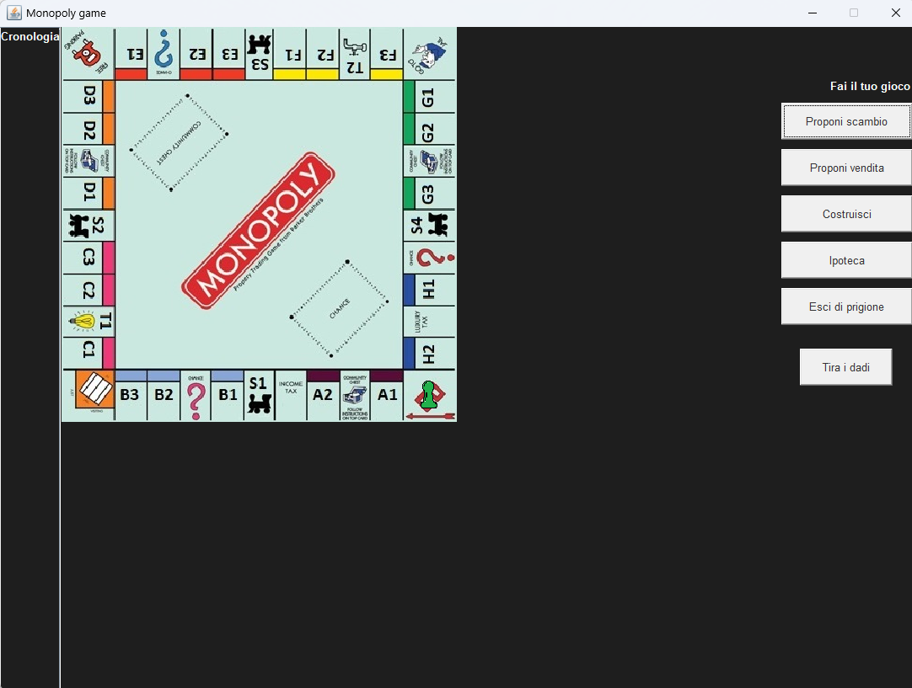
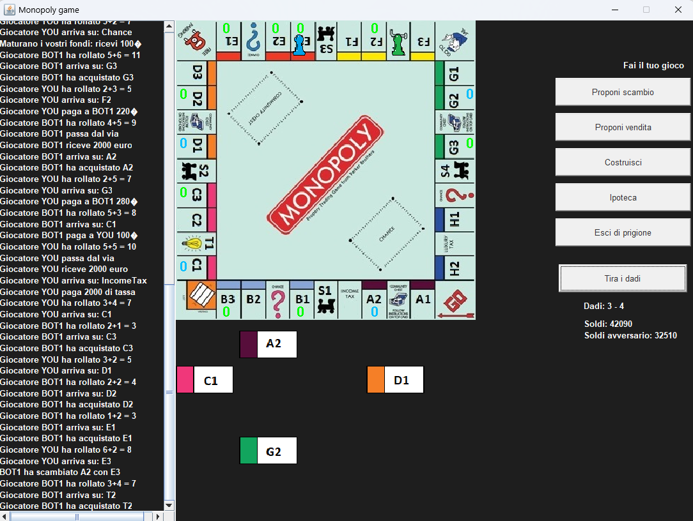

# 🏠 Monopoly Libratus

## Overview
**Monopoly Libratus** is a digital adaptation of the classic board game **Monopoly** where your primary opponent is an **AI** developed using the **DLV (Disjunctive Logic Programming System)**. The AI is capable of complex reasoning, making strategic decisions as it plays against you, giving you a challenging and dynamic gaming experience.

### Features
- **Single Player Mode**: Compete against a smart AI opponent with varying levels of strategic depth.
- **Classic Monopoly Rules**: All the familiar rules and mechanics of the Monopoly game have been implemented.
- **AI Opponent Using DLV**: The AI opponent is powered by Answer Set Programming (ASP) through the DLV system, providing a challenging and unpredictable adversary.

---

## 🧠 AI Logic with DLV
The AI opponent is developed using DLV, a Disjunctive Logic Programming System, enabling it to make strategic decisions based on complex logic rules. This allows the AI to:
- **Trade properties**, 
- **Negotiate deals**, 
- **Purchase properties strategically**, 
- **Build houses/hotels**, 
- **Decide whether to participate in auctions**.

The DLV system ensures that the AI plays intelligently, adapting to the current game state to keep you engaged.

---

## 🛠️ Installation and Setup

### Prerequisites
- **Java Development Kit (JDK) 8 or above**: [Install JDK](https://www.oracle.com/java/technologies/javase-downloads.html)
- **Maven**: [Install Maven](https://maven.apache.org/install.html)
- **DLV** system (for handling the AI logic)

### Clone the Repository
```bash
git clone https://github.com/lanor-97/Monopoly-Libratus.git
cd Monopoly-Libratus
```

### Build the project
```bash
mvn clean install
```

### Running the game
```bash
java -jar target/MonopolyLibratus-1.0-SNAPSHOT.jar
```

## 🖼️ Screenshots

### Game start


### In the middle of the game
